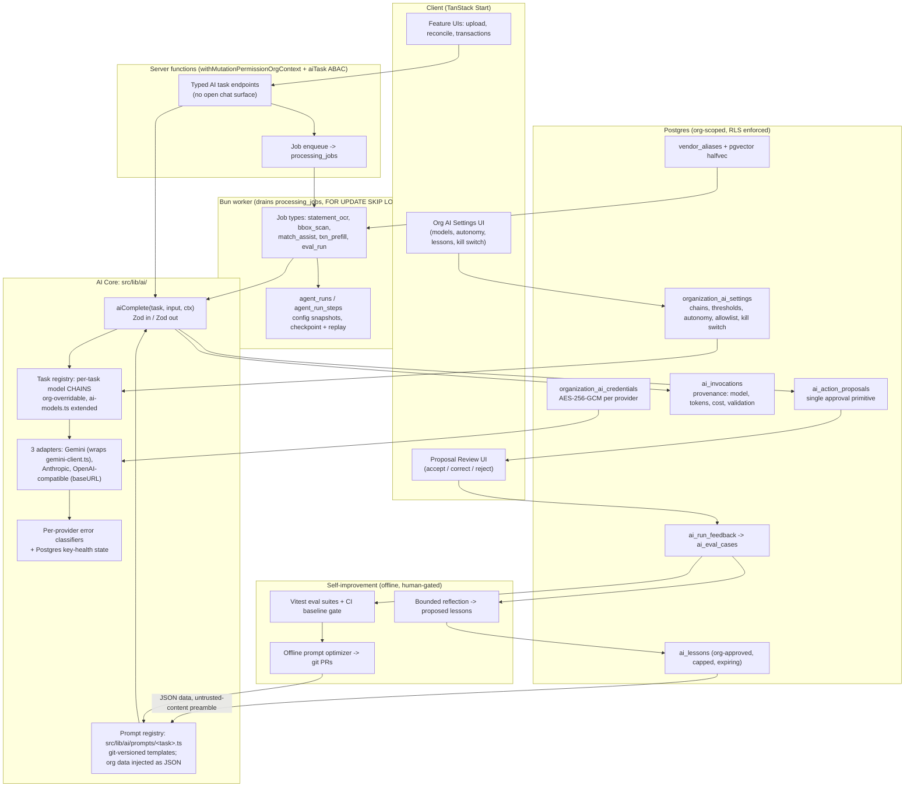

# Buwiz Books: AI-Native + Self-Improving Architecture

Status: adopted design. Companion docs: [AI_MULTIPROVIDER_PLAN.md](./AI_MULTIPROVIDER_PLAN.md) (provider façade contract, referenced not duplicated), [SELF_IMPROVING_AGENT_RESEARCH.md](./SELF_IMPROVING_AGENT_RESEARCH.md) (improvement-loop research, referenced not duplicated), `ai_findings.md` (ground truth on current AI surface — treat it, not the multiprovider plan's §1, as the baseline).

---

## TL;DR

The current architecture is **~70% sufficient** for an AI-native app. The stack — TanStack Start server functions, Drizzle/Postgres, per-org encrypted secrets, a per-org/per-task model registry (`src/lib/ai-models.ts`), and an already-built-but-unused job-lease system (`src/lib/inbox/processing-job-lease.ts`) — is the right substrate. What's missing is not new infrastructure but **seven additions**: (1) a provider-neutral `aiComplete` façade with Zod output validation on every call, (2) a single generalized **`ai_action_proposals`** approval primitive replacing 8-of-9 features' current auto-apply behavior, (3) org-scoped AI tables (settings, credentials, invocations, proposals, lessons, eval cases, vendor aliases), (4) a Bun worker draining the existing `processing_jobs` table with **`agent_runs`/`agent_run_steps`** checkpoint provenance, (5) chained multi-provider model routing with validation-triggered escalation, (6) an **earned-autonomy** ladder (every org starts at suggest-only; auto-apply is earned via that org's own eval history and every widening is audited), and (7) the org-scoped self-improvement loop (capture → evals → bounded reflection → offline prompt optimization).

Everything runs on Postgres + Bun + existing patterns. **No Redis, no queue service, no vector DB, no agent framework.** We do not adopt "graph engineering" as a framework (the label is not even Boris Cherny's — see §3); we adopt its durable primitives: code-owned routing, typed state, verification gates, and run provenance. RAG is used in exactly three narrow places (§4). End users may **not** install their own MCP servers — firm policy with rationale in §6. Honest total effort: **14–19 engineering weeks** (roughly 4–4.5 calendar months for 1–2 engineers), with user-visible value shipping from week ~4 and reconciliation quality wins by week ~8.

---

## Architecture overview



Model output **never writes to the ledger**. It lands in `ai_action_proposals`; deterministic code and humans apply. The worker, not the request, does the heavy compute. The improvement loop runs offline and ships changes as git PRs behind an eval gate.

---

## 1. Per-org scoping (Q1)

**Every organization gets its own AI configuration, memory, and evaluation data — enforced structurally, not by convention.** Each table in the data model (see [Data model](#data-model)) keys on `organizationId`, follows the composite `(organization_id, id)` FK pattern from `drizzle/0024_tenant_lineage_integrity.sql`, ships with RLS policies, and is accessed via `ctx.db` (the `withOrgContext` transaction that sets `app.current_organization_id`, `src/db/index.ts:61-80`) from day one.

Org-scoped per row:

- **Model chains and thresholds** — `organization_ai_settings` (typed table mirroring `organization_accounting_settings`, `src/db/schema/inbox.ts:32-70`), replacing the client-visible `auth_organizations.metadata` keys (`src/lib/org-metadata.ts:7-30`) as the home for AI config.
- **Credentials** — `organization_ai_credentials`, generalizing the Gemini-shaped `organization_secrets.geminiApiKeys` column (`src/db/schema/auth.ts:104-115`) to `(organizationId, provider, encryptedKey, …)` rows, reusing the AES-256-GCM envelope in `src/lib/crypto.ts:73-129`.
- **Memory/lessons** — `ai_lessons`: per-org, human-approved, size-capped, expiring (SELF_IMPROVING Phase 3).
- **Eval data** — `ai_eval_cases` with org-scoped rows; a global golden set exists only for cases an org has **explicitly opted in** to share (anonymization alone is not consent — see §8).
- **Feedback and provenance** — `ai_run_feedback` and `ai_invocations` are org-keyed, so each org's accuracy history is queryable in isolation. This is what makes **earned autonomy** (§2) per-org: org A's eval history can unlock auto-apply for org A without changing anything for org B.
- **Autonomy level, task allowlist, spend cap, kill switch** — all rows in `organization_ai_settings`; every change writes to `activity_logs` (`src/db/schema/activity-logs.ts:9`), so scope expansion is a deliberate, audited config change.

**What stays global:** prompt _templates_ (git-versioned in `src/lib/ai/prompts/<task>.ts`), default model chains, Zod schemas, graders, and invariant validators. Orgs **parameterize** prompts — their lessons, chart-of-accounts context, and aliases are injected as JSON-encoded _data_ behind an untrusted-content preamble — but orgs **never author prompt text**. This is a deliberate rejection of org-level prompt overrides: tenant-authored text adjacent to instructions is a prompt-injection surface a multi-tenant ledger cannot afford (see §6 threat model). Different org workflows are expressed through configuration (chains, thresholds, allowlists, lessons, aliases, review policies), not through forked prompts.

Two Phase-0 prerequisites make per-org scoping trustworthy: fixing the `getSessionContext` first-membership fallback (`src/lib/auth-middleware.ts:58-84`), which can silently pick an arbitrary org for multi-org users — unacceptable once per-org AI spend and credentials diverge — and enforcing RLS for real via the staged `drizzle/rls_hardening.sql` rollout (today the app connects as table owner and policies carry an `IS NULL` bypass).

---

## 2. Architecture sufficiency — and the finance-only restriction (Q2)

**Verdict: ~70% sufficient.** The substrate is right; six gaps must close:

| Gap                                                                                                                                                                                                                                              | Fix                                                                                                                                              | Where   |
| ------------------------------------------------------------------------------------------------------------------------------------------------------------------------------------------------------------------------------------------------ | ------------------------------------------------------------------------------------------------------------------------------------------------ | ------- |
| Provider leak: `callWithRetry` hands callers a raw `GenerativeModel` (`src/lib/gemini-client.ts:336`)                                                                                                                                            | `aiComplete(task, input, ctx)` façade per AI_MULTIPROVIDER_PLAN §2.1; three adapter shapes                                                       | Phase 1 |
| 5 of 7 parse sites cast model output without validation (ai_findings #12 corrected scope, e.g. `-ai-statement-ocr.ts:302`; the two graceful ones are `-ai-classify-document.ts:115-122` and `extractBoundingBoxes` in `-ai-bill-ocr.ts:621-623`) | Zod re-validation on every output — pulled forward to **Phase 0**, before the façade exists                                                      | Phase 0 |
| 8 of 9 AI features auto-apply without confirmation (ai_findings, line 56)                                                                                                                                                                        | `ai_action_proposals` single approval primitive; entity resolver demoted (closes the `-ai-entity-resolver` privilege escalation, ai_findings #4) | Phase 1 |
| No worker: OCR runs inside open Postgres transactions                                                                                                                                                                                            | Bun worker on existing `processing_jobs` + `agent_runs` checkpoints                                                                              | Phase 2 |
| No telemetry (ai_findings #10)                                                                                                                                                                                                                   | `ai_invocations` — also pulled forward to **Phase 0** so the flywheel has months of data before eval tooling ships                               | Phase 0 |
| Foundation debt the plans assume away: decorative RLS, advisory period lock, no CI test gate (TECH_DEBT #13/#10/#5)                                                                                                                              | Phase 0 hardening                                                                                                                                | Phase 0 |

**"Able to do a lot, restricted to finance" is enforced by capability, not by prompt.** Four hard walls, none of which a prompt injection can talk its way past:

1. **No open chat surface.** Every AI entry point is a typed task (`ocr`, `classify`, `match_assist`, `txn_prefill`, …) with a Zod input schema and a Zod output schema. There is no free-text→free-text endpoint. "Do a lot" means many _tasks_, not one general assistant.
2. **Closed, permission-mapped tool set.** When the one agentic loop ships (Phase 7, §4), it gets only first-party finance tools, each mapped to an explicit ABAC statement — a **new `aiTask` resource** (actions `view`/`run`/`configure`, added alongside the existing statement in `src/lib/permissions.ts`) plus `transaction`/`reconciliation` permissions — read-only, with runtime egress **deny-by-default and private-IP ranges blocked**, mirroring Anthropic's no-network Skills sandbox ([Agent Skills overview](https://platform.claude.com/docs/en/agents-and-tools/agent-skills/overview)). The existing `agentRule` resource (`src/lib/permissions.ts:35`) is **not** reused: it is actively consumed by the deterministic review-agents feature (`src/routes/api/-review-agents.ts:9/92/184` gate list/save/run; `src/routes/review-agents.tsx:42-43` checks `configure`/`run` client-side), and piggybacking on it would silently grant AI-task rights to any role holding `agentRule:run` for review rules — and vice versa. A distinct resource keeps the two grants independently assignable.
3. **Grounding contract** (AI_MULTIPROVIDER_PLAN §2.5): models may only reference caller-supplied entity IDs; hallucinated IDs are blanked; money math happens in TypeScript, never in the model.
4. **Write authority is never delegated.** Model output lands in `ai_action_proposals`; deterministic validators plus humans (or an earned auto-apply policy, below) apply it. A structural invariant in code — not config — caps every AI-generated match suggestion at confidence 84, strictly below the 85 auto-link threshold (`src/lib/auto-matcher.ts:60-62`), so no routing or configuration change can ever let an LLM auto-link ledger entries.

**Earned autonomy** reconciles safety with "less clicking over time." `organization_ai_settings.autonomyLevel` has three values: `suggest` (immutable default for every org and every new task), `auto_apply_high_confidence`, and `per_action` policies. An org may only widen autonomy for a task after its own eval history demonstrates accuracy (e.g. ≥98% acceptance over ≥200 proposals for that task), and each widening is an org-admin action written to `activity_logs`. The flywheel therefore converts into visibly less manual data entry — but only after the org's own data proves it, and never for match auto-linking (wall 4 is not configurable).

---

## 3. Graph engineering — verdict (Q3)

**Do not adopt it as a framework. Adopt its primitives, which digits already half-has.**

First, the provenance correction: the "graph engineering" label is **not Boris Cherny's**. The Substack piece ([aisuperpowers.substack.com/p/the-loop-is-over](https://aisuperpowers.substack.com/p/the-loop-is-over)) is by "Alex Prompter" (July 22, 2026) and never cites Cherny. Cherny's first-party material ([Bloomberg Odd Lots, July 20, 2026](https://www.bloomberg.com/news/audio/2026-07-20/odd-lots-how-claude-code-is-reshaping-software-podcast)) is about agent _loops_ and verification. The wave was ignited by a Peter Steinberger one-liner and amplified by commentary ([Turing Post](https://www.turingpost.com/p/is-graph-engineering-real-why-everyone-is-talking-about-it), [SmartScope](https://smartscope.blog/en/blog/graph-engineering-loop-engineering-logic-review/)); the viral "18% higher accuracy, 85% lower cost" stat is debunked. Even the Substack post concedes: "A graph is not a replacement for a loop. Every node in a graph is a loop." The substance is a rebrand of Anthropic's December 2024 workflow patterns ([Building Effective Agents](https://www.anthropic.com/engineering/building-effective-agents)) — whose core warning applies directly: workflows for predictable tasks, agents only for unpredictable ones, and "complexity should follow demonstrated need."

Buwiz Books' pipelines (OCR → validate → insert → match) are _predictable_. They are workflows. So:

- **Where "graphs" apply:** nowhere as a runtime. We do **not** build a graph executor (the ~400-line custom executor idea was rejected — retry semantics, fan-out joins, cancellation, and mid-run node versioning are exactly what balloons for a 1–2 engineer team). Instead, multi-stage flows are expressed as **chained job types on `processing_jobs`**, with **`agent_runs`/`agent_run_steps`** rows layered on top (the `review_rule_runs` config-snapshot pattern, `src/db/schema/inbox.ts:635-697`) recording every step, its input/output refs, and the active config snapshot. That gives crash recovery (resume from last completed step) and auditor replay (reconstruct every edge taken) — the two real benefits graph frameworks sell — without the framework.
- **Where agentic loops apply:** exactly one candidate — reconciliation-exception investigation ("why doesn't this month balance?"), where steps are genuinely unpredictable. Phase 7, optional, read-only tools, `maxTurns`-bounded, suggestions only (§4).
- **Where single LLM calls apply:** everywhere else — the majority of the AI surface (§4).

The durable primitives we do adopt: typed state between steps (Zod), code-owned routing (TypeScript decides what runs next, never the model), verification gates ("never guess and continue" → `needs_review` flags), blocking-then-LLM-arbitration for entity resolution (the "Edwin/Buzz Aldrin" pattern), and per-run provenance.

---

## 4. RAG and orchestration patterns (Q4)

### RAG: mostly no

Finance queries are exact-match problems — amounts, dates, balances, and reconciliation math are SQL via Drizzle, not similarity search. Per Anthropic's guidance, corpora under ~200k tokens shouldn't use RAG at all ([Contextual Retrieval](https://www.anthropic.com/news/contextual-retrieval)). Embeddings earn their place in exactly three spots, all pgvector (no vector DB, no framework):

1. **Vendor/descriptor normalization** — `vendor_aliases.embedding` (halfvec + HNSW, hybrid with pg_trgm): "AMZN Mktp US\*2K3" ≈ "Amazon office supplies". Feeds the residual matcher and party resolution.
2. **Categorization-by-precedent** — retrieve the org's k most similar already-categorized transactions as in-context examples for a single classify call: Anthropic's "single call + retrieval + examples" sweet spot.
3. **Document search** — only if a tenant corpus exceeds ~200k tokens; below that, stuff + prompt-cache. If chunking statements, use contextual retrieval (prepend "statement, account X, period Y").

Multi-tenancy caveat: pgvector applies WHERE filters _after_ the approximate index scan ([pgvector README](https://github.com/pgvector/pgvector)) — always filter `organization_id` and enable `hnsw.iterative_scan` or per-org partial indexes.

### Orchestration: pattern per task

| Task                                                                         | Pattern                          | Notes                                                                                                                                                                                                                                                                                                  |
| ---------------------------------------------------------------------------- | -------------------------------- | ------------------------------------------------------------------------------------------------------------------------------------------------------------------------------------------------------------------------------------------------------------------------------------------------------ |
| Date parse, document classify, receipt/bill field extraction, NL→transaction | **Single schema'd call**         | No orchestration.                                                                                                                                                                                                                                                                                      |
| Statement OCR → validation → line insertion → matching                       | **Prompt chain with code gates** | Each gate is TypeScript: Zod parse → `validateStatement` invariants (`src/lib/statement-validator.ts:45-182`), which must actually _gate_ (fixing ai_findings #5) → batched insert → deterministic `runAutoMatcher`.                                                                                   |
| Ingest triage                                                                | **Routing node**                 | One cheap-model call consolidates the three duplicate classification passes (`classifyDocument`, statement OCR's classification block, receipt `documentSubtype`) and routes **clean CSV statements away from vision models entirely** — a cost _and_ accuracy win, since CSV needs a parser, not OCR. |
| Extraction repair                                                            | **Evaluator-optimizer, bounded** | Deterministic validators first (Σ lines = stated total; opening + net = closing; dates in period). On failure: one evaluator call naming violations → re-invoke generator with violations → max 2 retries → `needs_review`. Never auto-apply from the repair path.                                     |
| Bulk categorization                                                          | **Parallelization**              | Batched worker jobs, fan-out in TypeScript.                                                                                                                                                                                                                                                            |
| Reconciliation-exception investigation                                       | **Agentic loop — the only one**  | Phase 7. Read-only first-party tools, `maxTurns` bound, explorer/verifier separation, outputs into existing `reconciliation_suggestions`/`reconciliation_flags`, never writes. Nothing else in the app justifies a loop.                                                                               |

---

## 5. Model routing (Q5)

The current per-org, per-category registry (`src/lib/ai-models.ts`: `ocr`/`textAnalysis`/`imageGen`, org metadata overrides, all Gemini) is the right skeleton. Improvements, per the multi-provider plan plus current provider economics:

- **Chains, not single models.** Each category resolves to an ordered `{provider, model, params}[]`, org-overridable. Defaults: `ocr`: `gemini-3.5-flash-lite` (media_resolution high) → `gemini-3.6-flash` → `claude-sonnet-5`; `textAnalysis`: `flash-lite` → `claude-haiku-4-5`; new `matching` category escalating to `claude-opus-4-8`/`gemini-3.1-pro`. Gemini-first means zero day-one behavior change and ~4–10× cheaper per page (~258 tokens/page vs ~2,300 on Anthropic; [Gemini document processing](https://ai.google.dev/gemini-api/docs/document-processing), [Claude PDF support](https://platform.claude.com/docs/en/docs/build-with-claude/pdf-support)).
- **Two-layer failover.** `gemini-client.ts` key rotation/backoff stays as the intra-provider layer. The router adds inter-provider hops on 429/5xx/timeout/schema-rejection, respecting the org provider allowlist. The `if (!pick)` all-keys-exhausted throw at `gemini-client.ts:351` becomes "advance the chain."
- **Pre-egress PII redaction (mandatory).** Per AI_MULTIPROVIDER_PLAN §2.4 item 7, §2.5, and the unconditional §6 checklist item, a redaction pass runs before any third-party egress — account numbers and SSNs masked beyond last-4 — on every provider in the chain, not just the new Anthropic/OpenAI hops. This is the second mandatory mitigation alongside the org provider allowlist and ships with it in Phase 4.
- **Per-provider error classifiers.** The current message-substring matching (`isTransientError`/`isInvalidKeyError`, `gemini-client.ts:262-305`) is replaced by typed classifiers per adapter. **Key-health/cooldown state moves from process-local memory to Postgres** — not Redis — so failover works across Cloud Run replicas while staying inside the existing RLS, backup, and audit boundary.
- **Confidence-based escalation, validation-triggered.** Standardize confidence to 0–1 (currently mixed 0–1 and 0–100). Escalate when: Zod parse fails after one bounded repair; a finance invariant fails; grounding blanks IDs; or self-reported confidence < the org's per-task threshold. The harness validators _are_ the escalation signal — no separate scorer model.
- **One Zod schema, three strict modes.** Schemas are designed to the **intersection** of Anthropic constrained decoding, OpenAI `strict: true` json_schema, and Gemini `responseSchema`: no recursion, no numeric min/max, flat-ish nesting — and the same Zod schema re-validates every output regardless of provider (Gemini guarantees syntax only; [structured output docs](https://ai.google.dev/gemini-api/docs/structured-output)).
- **Kill the duplicated resolution logic.** `callWithRetry` reimplements `resolveModelForTask` inline (drift risk); the router becomes the single resolver.
- **Batch + cache.** Non-interactive re-OCR goes through batch endpoints (50% off on all three providers); static system/schema preambles are prompt-cached.
- **Provenance.** Every hop is an `ai_invocations` row with the **pinned** model ID, chain position, and escalation reason.

---

## 6. Skills & MCP policy (Q6)

**Firm recommendation: end users may NOT install their own MCP servers. Your suspicion is correct, and this is a policy, not a preference.**

Rationale — digits' model context already contains two legs of Simon Willison's "lethal trifecta" ([simonwillison.net/2025/Jun/16/the-lethal-trifecta](https://simonwillison.net/2025/Jun/16/the-lethal-trifecta/)): **private financial data** and **attacker-writable content** (anyone who emails your customer an invoice injects text into the model's context via OCR). User-attached MCP servers supply the third leg — egress — plus four protocol-native attack classes documented in MCP's own spec: tool poisoning (tool descriptions are untrusted and injected into context), rug pulls via `notifications/tools/list_changed` (a server vetted day 1 turns malicious day 30 with no client signal), confused-deputy OAuth abuse, and SSRF from _your_ backend into _your_ VPC via attacker-controlled metadata URLs ([MCP security best practices](https://modelcontextprotocol.io/specification/2025-06-18/basic/security_best_practices)). Anthropic's best published prompt-injection defense still reports a ~1% residual attack success rate ([prompt-injection defenses](https://www.anthropic.com/research/prompt-injection-defenses)) — a failing grade for a ledger.

Policy, four tiers:

1. **First-party tools only** in any agent context: OCR/parse/classify/match tools digits authors, outputs schema-validated and treated as data, never instructions.
2. **Integrations via a vendor-vetted allowlist** (bank feeds, QuickBooks/Xero): digits registers the OAuth clients, enforces RFC 8707 audience binding, never passes client tokens through, read-only by default.
3. **Customer extensibility = signed webhooks + public API** — these never place third-party content or tool descriptions inside model context, so the trifecta never assembles.
4. **If partners demand more later:** a reviewed connector program modeled on Anthropic's directory policy (test accounts, correct tool annotations, pinned tool definitions, diff-and-re-review on `list_changed`), gated to org admins — never individual end users.

**Internal skills:** none needed at runtime. The "skills" digits needs are its prompt-registry entries plus the closed first-party tool set; agent runtime egress is deny-by-default with private-IP blocking (this is a finance-restriction mechanism, §2, not just MCP hygiene).

---

## 7. Reconciliation: where the heavy compute goes (Q7)

The worst current defect: Gemini calls (120s timeout × key rotation × backoff sleeps) run inside an **open Postgres transaction** — `withOrgContext` wraps every handler in `db.transaction` (`src/db/index.ts:61-67`), and `uploadBankStatement` (`src/routes/api/reconciliations/-_statement-upload.ts:369-785`) holds it across OCR, pdf-to-img, R2 I/O, and row-per-INSERT line loops. All heavy/AI compute moves to the worker:

1. **Upload (fast, transactional):** R2 upload, document row, enqueue `statement_ocr` job, return job ID. Client polls — the `reconciliation-ocr-store` UX shape already exists.
2. **Worker: OCR → validate → insert.** `parseStatementDocument` behind `aiComplete`; `validateStatement` actually gates; batched `insert().values([...])` replaces the per-row loop; each stage is an `agent_run_steps` row, so a crash resumes from the last completed step and an auditor can replay the path.
3. **Worker: deterministic `runAutoMatcher`** — unchanged algorithm; ≥85 auto-links exactly as today.
4. **Worker: LLM match-assist over the residual unmatched set only.** Small token cost. Blocking happens in SQL (amount/date/token-overlap candidates); the LLM arbitrates within blocks using `vendor_aliases`; output is existing `MatchSuggestion` shapes **hard-capped at confidence 84** so it can never auto-link, including **`split`-type suggestions** — the enum exists but nothing populates it today, and one-to-many matches are a top real-world reconciliation pain. Dismissals are remembered (adopting the dedup subsystem's `keep_separate` negative memory) so re-runs stop re-suggesting; stale pending suggestions are cleared on re-run (fixing the accumulation bug in `reRunMatching`).
5. **Worker: `create_txn` prefill.** Unmatched lines get category/party pre-filled via `-ai-transaction-parse` + the entity resolver — now suggestion-only through `ai_action_proposals` — making creation one-click-accept.
6. **Finalize:** the arithmetic gate (`src/lib/reconciliation-finalize.ts:47-146`) is unchanged; a cheap anomaly pass (new payees, amount outliers, check-sequence gaps) emits the defined-but-never-used `reconciliation_flags` enums.

The rule-based `runReconciliationAgent` stays deterministic. AI widens its _input_ (better suggestions), never its authority.

---

## 8. Self-improving loop, org-scoped (Q8)

The loop researched in [SELF_IMPROVING_AGENT_RESEARCH.md](./SELF_IMPROVING_AGENT_RESEARCH.md) maps onto this architecture directly, with every stage org-scoped:

- **Capture (starts Phase 0/1, not Phase 6):** every call → `ai_invocations` (Phase 0); every accept/correct/reject on an `ai_action_proposals` row → `ai_run_feedback` (Phase 1). User corrections are ground-truth labels. Because the proposal table is a _single_ primitive, feedback labels are schema-uniform across all features — no per-feature drift for evals to untangle. By the time eval tooling ships (~Phase 6), the flywheel has months of data.
- **Curate:** a script promotes corrected runs into `ai_eval_cases`, each row carrying a **PII-redaction flag**. Org rows stay org-scoped; promotion into the cross-org/global golden set requires **explicit org opt-in** — anonymization alone is not consent.
- **Grade:** Vitest eval suites with code graders (field accuracy, invariant pass rate, pass^k for finance tasks) run in CI against the golden + per-org sets; a baseline gate blocks prompt-registry PRs that regress. Prerequisite: the deploy pipeline gains a test gate (TECH_DEBT #5) — Phase 0. Seed coverage at the two known holes: `getOrganizationSecrets` (zero tests, ai_findings #22) and the permanently-green e2e AI test (#23).
- **Reflect (bounded):** an offline job distills recurring corrections into proposed `ai_lessons`; an org admin approves them in settings; active lessons are injected as JSON-encoded _data_ behind an untrusted-content preamble, size-capped, expiring. Lessons never touch graders, schemas, or prompt templates (the lessons store is itself an attack surface — SELF_IMPROVING threat model).
- **Optimize (offline):** a prompt-optimizer script (Ax, in `scripts/`) proposes template changes as **git PRs** behind the eval gate. **No runtime self-modification, ever** — the system improves through the same review pipeline as code.
- **Graduate:** the loop's output also feeds earned autonomy (§2): sustained per-org accuracy unlocks `auto_apply_high_confidence` per task, which is how the flywheel converts into fewer clicks rather than permanent approval queues.

Run-level provenance closes the replay gap: `ai_invocations` carries a **config snapshot** (prompt name + version, pinned model, chain position, active thresholds, lesson-set hash), and `agent_runs`/`agent_run_steps` snapshot pipeline config per run — so any historical run can be reconstructed as an eval case and any regression attributed to model change vs. router change vs. prompt change.

---

## Data model

All tables org-scoped with composite `(organization_id, id)` FKs (migration 0024 pattern), RLS policies from day one, accessed via `ctx.db`. Drizzle-style sketches (abbreviated):

```ts
// Per-org AI config — mirrors organization_accounting_settings (typed table, PK = orgId)
export const organizationAiSettings = pgTable("organization_ai_settings", {
  organizationId: text()
    .primaryKey()
    .references(() => organizations.id),
  taskChains: jsonb().$type<Record<AiTask, ChainEntry[]>>(), // override of global defaults
  confidenceThresholds: jsonb().$type<Record<AiTask, number>>(), // 0–1, standardized
  autonomy: jsonb().$type<Record<AiTask, "suggest" | "auto_apply_high_confidence">>(),
  // default "suggest" for every task; widening requires org-admin action + activity_logs row
  taskAllowlist: jsonb().$type<AiTask[]>(),
  providerAllowlist: jsonb().$type<Provider[]>(),
  monthlySpendCapUsd: numeric(),
  killSwitch: boolean().default(false),
  updatedBy: text(),
  updatedAt: timestamp(),
});

// Multi-provider credentials — generalizes organization_secrets.geminiApiKeys
export const organizationAiCredentials = pgTable("organization_ai_credentials", {
  id: uuid().defaultRandom(),
  organizationId: text().notNull(),
  provider: text().$type<"gemini" | "anthropic" | "openai" | "openai_compatible">(),
  encryptedKey: text(), // crypto.ts AES-256-GCM envelope, enc:v1:<iv>:<tag>:<ct>
  baseUrl: text(), // openai_compatible only
  label: text(),
  lastUsedAt: timestamp(),
  revokedAt: timestamp(),
});

// Cross-replica key/provider health — replaces process-local maps; NOT Redis
export const aiProviderHealth = pgTable("ai_provider_health", {
  organizationId: text(),
  credentialId: uuid(),
  cooldownUntil: timestamp(),
  consecutiveFailures: integer(),
  lastErrorClass: text(),
});

// Provenance for every model call
export const aiInvocations = pgTable("ai_invocations", {
  id: uuid(),
  organizationId: text().notNull(),
  task: text(),
  promptName: text(),
  promptVersion: text(),
  schemaHash: text(),
  provider: text(),
  model: text(), // pinned snapshot ID, never an alias
  chainPosition: integer(),
  escalationReason: text(),
  configSnapshot: jsonb(), // thresholds, lessonSetHash, params
  tokensIn: integer(),
  tokensOut: integer(),
  imageTokens: integer(),
  costUsd: numeric(),
  latencyMs: integer(),
  validationOutcome: text().$type<"valid" | "repaired" | "failed">(),
  agentRunStepId: uuid(),
  requestId: text(),
  createdAt: timestamp(),
});

// THE single approval primitive — replaces per-feature Apply/Dismiss wiring
export const aiActionProposals = pgTable("ai_action_proposals", {
  id: uuid(),
  organizationId: text().notNull(),
  kind: text().$type<
    | "match"
    | "categorize"
    | "create_txn"
    | "create_party"
    | "date_fix"
    | "split"
    | "document_type"
    | "prefill"
  >(),
  proposal: jsonb(), // typed payload per kind (Zod discriminated union)
  invocationId: uuid().references(() => aiInvocations.id),
  confidence: numeric(), // 0–1; match kinds structurally capped < auto-link
  status: text().$type<
    "pending" | "approved" | "corrected" | "rejected" | "auto_applied" | "expired"
  >(),
  approvedBy: text(),
  appliedAt: timestamp(),
  createdAt: timestamp(),
});

// Feedback = ground-truth labels for the flywheel
export const aiRunFeedback = pgTable("ai_run_feedback", {
  id: uuid(),
  organizationId: text().notNull(),
  proposalId: uuid(),
  invocationId: uuid(),
  verdict: text().$type<"accepted" | "corrected" | "rejected">(),
  correction: jsonb(), // the user's actual value, when corrected
});

// Org memory — human-approved, capped, expiring
export const aiLessons = pgTable("ai_lessons", {
  id: uuid(),
  organizationId: text().notNull(),
  task: text(),
  lesson: text(), // injected as JSON data, never as prompt text
  sourceFeedbackIds: jsonb(),
  status: text().$type<"proposed" | "active" | "retired">(),
  approvedBy: text(),
  expiresAt: timestamp(),
});

// Eval datasets
export const aiEvalCases = pgTable("ai_eval_cases", {
  id: uuid(),
  organizationId: text(), // NULL = global golden set (opt-in only)
  task: text(),
  inputRef: jsonb(),
  expected: jsonb(),
  provenance: text().$type<"curated_from_feedback" | "authored">(),
  piiRedacted: boolean(),
  orgConsentAt: timestamp(), // required before going global
});

// Pipeline run ledger — review_rule_runs pattern over processing_jobs chaining
export const agentRuns = pgTable("agent_runs", {
  id: uuid(),
  organizationId: text().notNull(),
  kind: text().$type<"statement_pipeline" | "match_assist" | "eval_run">(),
  status: text(),
  configSnapshot: jsonb(), // prompt versions, chains, thresholds
  startedAt: timestamp(),
  finishedAt: timestamp(),
});
export const agentRunSteps = pgTable("agent_run_steps", {
  id: uuid(),
  organizationId: text().notNull(),
  runId: uuid(),
  step: text(),
  status: text(),
  inputRef: jsonb(),
  outputRef: jsonb(),
  processingJobId: uuid(),
  error: jsonb(),
  startedAt: timestamp(),
  finishedAt: timestamp(),
});

// Vendor memory for matching — pgvector
export const vendorAliases = pgTable("vendor_aliases", {
  id: uuid(),
  organizationId: text().notNull(),
  normalizedDescriptor: text(),
  partyId: uuid(),
  embedding: halfvec({ dimensions: 1024 }), // HNSW index, per-org partial or iterative_scan
  source: text().$type<"user_match" | "llm_suggestion_accepted">(),
});
```

No new stores: pgvector for embeddings, `processing_jobs` for queueing, `ai_lessons` for memory, `ai_provider_health` for failover state, Postgres advisory locks (already used in bill OCR) where needed. All new AI endpoints gate on a **new `aiTask` ABAC resource** (`view`/`run`/`configure`, added to the statement in `src/lib/permissions.ts`) instead of `document:upload` (fixes ai_findings #16). The existing `agentRule` resource is deliberately not reused — it already gates the deterministic review-agents feature (`src/routes/api/-review-agents.ts`, `src/routes/review-agents.tsx`), and sharing it would couple AI-task permissions to review-rule permissions in both directions.

---

## Implementation status (all phases built)

| Phase                                 | State | What shipped                                                                                                                                                                                                                                                                                                                                                        |
| ------------------------------------- | ----- | ------------------------------------------------------------------------------------------------------------------------------------------------------------------------------------------------------------------------------------------------------------------------------------------------------------------------------------------------------------------- |
| **0 — Trust floor**                   | ✅    | Zod validation on every model output; `ai_invocations` telemetry; `getSessionContext` org/role fix; RLS context-plumbing; CI gate incl. component tests.                                                                                                                                                                                                            |
| **1 — Façade + proposals**            | ✅    | `aiComplete` as the sole model entry point; git-versioned prompt registry (12 tasks); `ai_action_proposals` + `ai_run_feedback`; confirm-first everywhere (entity resolver match-only, classify/bill no longer auto-apply); `aiTask` ABAC + two-key model; proposal review UI + `/ai-proposals`.                                                                    |
| **2 — Worker + async reconciliation** | ✅    | Generalized pull-worker + job registry; `agent_runs`/`agent_run_steps` with crash-resume; statement pipeline staged OUT of the request transaction; `validateStatement` actually gates (+ audited override); batched inserts; CSV parsed deterministically; ingest triage consolidated; suggestion hygiene + dismissal memory.                                      |
| **3 — Match-assist + prefill**        | ✅    | `vendor_aliases` + normalization + alias learning from human-confirmed matches; SQL blocking with split enumeration; **the hard 84-confidence cap as one choke point**; grounding; `match_assist` job chained off the pipeline + manual trigger; deterministic anomaly flags at finalize; **split apply** via `statement_line_matches` with finalize-math union.    |
| **4 — Multi-provider routing**        | ✅    | Anthropic + OpenAI adapters; typed error taxonomy; OpenAI strict-schema conversion; cross-replica `ai_provider_health` keyed on a key fingerprint; mandatory pre-egress PII redaction (branded type); per-task chains with **OCR pinned to Gemini**; `organization_ai_credentials` + `organization_ai_settings`; router wired into `aiComplete`; admin settings UI. |
| **5 — Harness + earned autonomy**     | ✅    | Grounding enforcement in the façade; per-org autonomy ladder (≥98% over ≥200 proposals, auto-demotion, `STRUCTURAL_MANUAL_KINDS` for match/split); token pricing + monthly spend cap; kill switch + task allowlist at the single choke point.                                                                                                                       |
| **6 — Self-improvement loop**         | ✅    | `ai_lessons` (approved, capped, expiring, injected as JSON data behind an untrusted preamble) + `ai_eval_cases`; consent-gated curation script; separate `test:evals` harness with code graders, never in normal CI; bounded weekly reflection job.                                                                                                                 |
| **7 — Investigation agent**           | ✅    | The one agentic loop: 7 read-only org-scoped tools, `maxTurns` + wall-clock bounds, untrusted-envelope tool results, findings as reviewable suggestions. Plain TS tool loop on the Anthropic adapter — deliberately NOT an agent SDK.                                                                                                                               |

Verified: lint + typecheck clean; **828 unit / 196 integration / 17 component / 30 eval tests** passing; formatting clean. Nothing committed.

**Not wired to UI yet:** `startFieldScan` (the bbox job exists; the client still uses the per-page loop) and the reflection/curation schedulers (jobs + script exist; no cron entry). Both are noted as follow-ups rather than blockers.

---

## Phased implementation roadmap

Effort assumes 1–2 engineers. Each phase is independently shippable. **Honest total: 14–19 engineering weeks (~4–4.5 calendar months)** — value ships from Phase 1 (validation + telemetry are live even earlier), and reconciliation quality lands by ~week 8.

### Phase 0 — Trust floor (2 wks) · _no dependencies; starts from current codebase_

- **Zod output validation on the 5 unvalidated parse routes** (`-ai-bill-ocr`, `-ai-receipt-ocr`, `-ai-statement-ocr`, `-ai-transaction-parse`, `-ai-date-parse`) — landed _now_, before the façade: bad extractions become `needs_review` instead of silently wrong ledger data.
- **`ai_invocations` table + logging** at every existing call site — telemetry starts accruing from week one.
- RLS hardening rollout (`drizzle/rls_hardening.sql`; fix the enumerated raw-`db` call sites), CI test gate on deploy (TECH_DEBT #5).
- **Fix `getSessionContext` first-membership fallback** (`auth-middleware.ts:58-84`) before per-org AI spend/credentials diverge.
- Confirm env-key AES encryption at rest (in flight on `codex/audit-integrity-follow-up`). The seed-superuser key leak (`scripts/seed-superuser.ts:48-55`) is **already fixed** on that branch — commit `79690ae` rewrote the script to insert the org with empty metadata and store the Gemini key via `updateOrganizationSecrets` into the server-only, encrypted `organization_secrets` table (ai_findings #2 is stale on this point). Standardize confidence to 0–1.
- Seed test coverage at the two known holes: `getOrganizationSecrets` (zero tests) and the permanently-green e2e AI test.

### Phase 1 — Façade + proposal primitive (2–3 wks) · _depends on Phase 0_

- `aiComplete` + three adapters per AI_MULTIPROVIDER_PLAN §2.1 (Gemini adapter wraps `gemini-client.ts` untouched); prompt registry `src/lib/ai/prompts/<task>.ts`; migrate `-ai-transaction-parse` first, then remaining sites; delete fence-parsing duplication. Zero behavior change on the model path.
- **`ai_action_proposals` + generalized review UI**; convert the 8 auto-applying features to proposals (default `suggest`); route entity-resolver party/account creation through proposals (closes the privilege escalation). `ai_run_feedback` capture begins here — the flywheel's data collection starts ~week 4.

### Phase 2 — Worker + async reconciliation (2 wks) · _depends on Phase 1_

- Bun worker draining `processing_jobs` (lease machinery already exists); job types `statement_ocr`, `bbox_scan`; `agent_runs`/`agent_run_steps` checkpointing; statement OCR/bbox out of request transactions; batched line inserts; suggestion dedup on re-run.
- **Ingest triage consolidation**: one cheap classification call replaces the three duplicate passes and routes clean CSVs away from vision OCR entirely.

### Phase 3 — Match-assist + prefill (2 wks) · _depends on Phase 2; sequenced BEFORE multi-provider because users feel matching quality immediately and never see provider failover_

- `vendor_aliases` + pgvector (hybrid with pg_trgm); residual-set LLM matching with SQL blocking, **hard 84 cap**, `split`-type suggestions, dismissal memory; `create_txn` prefill via proposals; anomaly flags at finalize.

### Phase 4 — Multi-provider routing (2 wks) · _depends on Phase 1; parallelizable with Phase 3 if 2 engineers_

- `organization_ai_credentials`; per-task chains + inter-provider failover; per-provider error classifiers replacing substring matching; `ai_provider_health` in Postgres; validation-triggered escalation; settings UI; provider allowlist; **pre-egress PII-redaction pass** (mask account numbers/SSNs beyond last-4 — mandatory before the new Anthropic/OpenAI egress goes live, AI_MULTIPROVIDER_PLAN §6); batch endpoints for re-OCR.

### Phase 5 — Harness + earned autonomy (2–3 wks) · _depends on Phases 1, 4_

- Grounding contract, bounded evaluator-optimizer repair loop, full `organization_ai_settings` (task allowlist, spend cap, kill switch — every change → `activity_logs`); the Phase 4 pre-egress PII-redaction pass becomes a harness-owned step (per AI_MULTIPROVIDER_PLAN §2.5) so no call path can bypass it; autonomy ladder with per-org eval-history graduation criteria.

### Phase 6 — Self-improvement loop (2–3 wks) · _depends on Phases 0 (CI gate), 1 (feedback), 5_

- Curation script → `ai_eval_cases` (PII flag, org opt-in for global set); Vitest eval suites + CI baseline gate on prompt PRs; bounded reflection → org-approved `ai_lessons`; offline optimizer (Ax) proposing prompt PRs.

### Phase 7 (optional) — Exception-investigation agent (2+ wks) · _depends on Phases 5, 6_

- The one agentic loop: read-only first-party tools mapped to ABAC statements, egress-denied runtime, `maxTurns` bound, suggestions only.

---

## What we are NOT doing, and why

- **No user-installed MCP servers or user-uploaded skills** — completes the lethal trifecta against a ledger; protocol-native tool poisoning, rug pulls, confused deputy, SSRF (§6). Extensibility ships as signed webhooks + public API.
- **No graph-execution framework and no custom graph executor** — digits' pipelines are predictable workflows; `processing_jobs` chaining + `agent_runs` provenance delivers crash recovery and replay without the executor a 1–2 engineer team would drown in (§3).
- **No Redis** — key-health, queueing, and rate state live in Postgres, inside the existing RLS/backup/audit boundary. Adding Redis creates a new unaudited store holding per-org operational state for zero capability we lack.
- **No vector database** — pgvector covers all three embedding use cases inside existing Drizzle transactions.
- **No agent framework / no LangGraph / no orchestrator-workers** — a single Bun worker and TypeScript routing suffice; complexity follows demonstrated need ([Building Effective Agents](https://www.anthropic.com/engineering/building-effective-agents)).
- **No org-authored prompt text** — orgs parameterize (lessons, CoA, aliases as JSON data); tenant-authored prompt text is an injection surface (§1).
- **No runtime self-modification** — prompts improve via offline optimizer → git PR → eval gate → review; never in production (§8).
- **No general-purpose assistant / open chat endpoint** — typed finance tasks only (§2).
- **No LLM auto-linking of ledger entries, ever** — the 84 < 85 cap is a code invariant, not a config value (§2, §7).
- **No fine-tuning, no third-party eval SaaS in the critical path** — per SELF_IMPROVING non-goals; finance documents stay inside the trust boundary.
- **No cross-org data sharing without explicit opt-in** — anonymization is necessary but not sufficient for golden-set promotion (§8).
- **No Rust/second stack** — `research/buwiz_agent.md`'s concepts (evidence vault, obligation calendar, LLM-proposes/rules-dispose) are harvested into this TS design; its stack is not.

---

## Sources

**In-repo:** `AI_MULTIPROVIDER_PLAN.md` · `SELF_IMPROVING_AGENT_RESEARCH.md` · `ai_findings.md` · `TECH_DEBT_AUDIT.md` · `src/lib/gemini-client.ts` · `src/lib/ai-models.ts` · `src/lib/auto-matcher.ts` · `src/lib/statement-validator.ts` · `src/lib/reconciliation-agent.ts` · `src/lib/inbox/processing-job-lease.ts` · `src/lib/inbox/duplicate-matcher.ts` · `src/lib/permissions.ts` · `src/lib/auth-middleware.ts` · `src/lib/crypto.ts` · `src/db/index.ts` · `src/db/schema/inbox.ts` · `drizzle/rls_policies.sql` / `drizzle/rls_hardening.sql` / `drizzle/0024_tenant_lineage_integrity.sql` · `src/routes/api/-ai-*.ts` · `src/routes/api/reconciliations/-_statement-upload.ts`

**Orchestration & agents:** [Anthropic — Building Effective Agents](https://www.anthropic.com/engineering/building-effective-agents) · [Claude Agent SDK overview](https://code.claude.com/docs/en/agent-sdk/overview) · [Agent SDK subagents](https://code.claude.com/docs/en/agent-sdk/subagents)

**"Graph engineering" provenance:** [The Loop is Over — aisuperpowers.substack.com](https://aisuperpowers.substack.com/p/the-loop-is-over) (Alex Prompter, not Cherny) · [Bloomberg Odd Lots with Boris Cherny, July 20, 2026](https://www.bloomberg.com/news/audio/2026-07-20/odd-lots-how-claude-code-is-reshaping-software-podcast) · [The Neuron summary](https://www.theneuron.ai/explainer-articles/claude-code-creators-boris-cherny-and-cat-wu-explain-how-to-use-agent-loops/) · [Turing Post — Is Graph Engineering Real?](https://www.turingpost.com/p/is-graph-engineering-real-why-everyone-is-talking-about-it) · [SmartScope review](https://smartscope.blog/en/blog/graph-engineering-loop-engineering-logic-review/)

**Retrieval:** [Anthropic — Contextual Retrieval](https://www.anthropic.com/news/contextual-retrieval) · [pgvector](https://github.com/pgvector/pgvector)

**MCP/skills security:** [MCP specification 2025-06-18](https://modelcontextprotocol.io/specification/2025-06-18) · [MCP security best practices](https://modelcontextprotocol.io/specification/2025-06-18/basic/security_best_practices) · [MCP authorization](https://modelcontextprotocol.io/specification/2025-06-18/basic/authorization) · [Anthropic — prompt-injection defenses](https://www.anthropic.com/research/prompt-injection-defenses) · [Simon Willison — The Lethal Trifecta](https://simonwillison.net/2025/Jun/16/the-lethal-trifecta/) · [Agent Skills overview](https://platform.claude.com/docs/en/agents-and-tools/agent-skills/overview) · [Anthropic directory policy](https://support.claude.com/en/articles/13145358-anthropic-software-directory-policy) · [Claude Code MCP docs](https://code.claude.com/docs/en/mcp)

**Provider capabilities & pricing:** [Gemini models](https://ai.google.dev/gemini-api/docs/models) · [Gemini pricing](https://ai.google.dev/gemini-api/docs/pricing) · [Gemini structured output](https://ai.google.dev/gemini-api/docs/structured-output) · [Gemini document processing](https://ai.google.dev/gemini-api/docs/document-processing) · [Gemini image understanding](https://ai.google.dev/gemini-api/docs/image-understanding) · [Gemini rate limits](https://ai.google.dev/gemini-api/docs/rate-limits) · [Claude vision](https://platform.claude.com/docs/en/docs/build-with-claude/vision) · [Claude PDF support](https://platform.claude.com/docs/en/docs/build-with-claude/pdf-support) · [Claude structured outputs](https://platform.claude.com/docs/en/docs/build-with-claude/structured-outputs) · [Claude pricing](https://platform.claude.com/docs/en/docs/about-claude/pricing) · [Claude models overview](https://platform.claude.com/docs/en/docs/about-claude/models/overview) · [OpenAI images & vision](https://developers.openai.com/api/docs/guides/images-vision) · [OpenAI PDF files](https://developers.openai.com/api/docs/guides/pdf-files) · [OpenAI structured outputs](https://developers.openai.com/api/docs/guides/structured-outputs) · [OpenAI pricing](https://developers.openai.com/api/docs/pricing)
