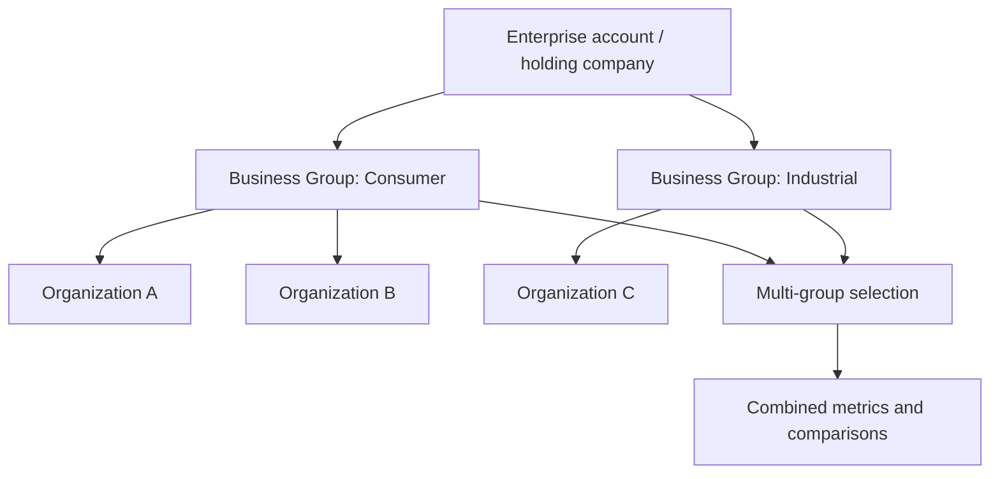
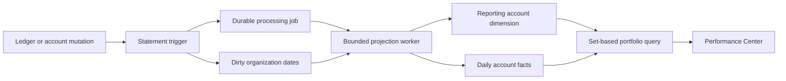

# Enterprise Business Groups

Status: implemented locally on 2026-08-01. The isolated production path is prepared for GCP project `buwiz-503321`, but production provisioning is blocked until billing is enabled. This document does not claim a live deployment or customer entitlement.

## What this feature is

Business Groups is an Enterprise portfolio-reporting layer above ordinary organizations. It lets a holding company select one or more reporting groups, see combined metrics, compare groups, and rank individual businesses without merging their books.

An organization remains the boundary for:

- its chart of accounts and ledger;
- members and permissions;
- reporting currency;
- close and approval workflows; and
- PostgreSQL row-level security.

A Business Group stores a non-destructive link to an organization. Linking or unlinking never moves, duplicates, or deletes accounting records.

## Why the model is flat

The initial hierarchy and “placement” design was removed. It added parent selection, cycle checks, partial-visibility edge cases, and recursive reads without improving the primary decision: which business is profitable, losing money, or contributing cash.

The implemented rule is simpler:

- an Enterprise account can own many Business Groups;
- one organization can have only one enabled Business Group assignment inside that Enterprise account;
- a user can select several groups for one portfolio report; and
- combined reporting deduplicates by organization ID as a defensive control.

If future customers need legal ownership percentages, divisions, regions, or consolidation scopes, those should be explicit dimensions with effective dates. They should not be overloaded into a UI parent dropdown.



There is no group-to-group or organization-to-organization parent edge.

## Enterprise gating

The `business_groups` entitlement supports `pending`, `active`, `grace`, `locked`, and `cancelled` states.

- Active permits reporting and configuration.
- Grace permits reporting and access reductions, but blocks new groups, links, role increases,
  restores, and other configuration expansion.
- Future pending, locked, cancelled, expired, or missing access fails closed. Once its start time
  arrives, a stored pending contract follows the same active, end, grace, and lock lifecycle.
- The contract carries an included linked-business limit across every active group in the Enterprise account.
- Every entitlement-gated group, membership, and assignment configuration change uses the
  account-scoped transaction advisory lock shared with manual entitlement updates. New-child
  writes pin auth identities and real FK parents in canonical user, organization, direct
  organization membership, Enterprise account, group, and Enterprise membership order before
  the account, assignment, and membership namespaces. Existing-row
  triggers never wait on an account namespace while holding a child row: contention raises
  retryable SQLSTATE `40001`. Manual updates take their operator lock before the shared account
  lock. Customer mutation APIs are intentionally single-Enterprise-account operations;
  cross-account bulk mutation must be split into account-sorted transactions.
- Direct operator configuration DML is restricted to one Business Group row per statement and
  transaction. Bulk repair tools must sort by Enterprise account and group, commit each group
  independently, and retry the complete transaction for SQLSTATE `40001` or `40P01` instead of
  issuing opposite-order multi-row updates through row triggers. A retry starts a new transaction;
  never continue the failed transaction or retry only its final statement.
- Provisioning and entitlement changes are versioned and audited.

Manual contract provisioning is deliberately an operator command, not a browser-callable privileged server function. Customer requests remain on request-scoped user or organization RLS connections. The operator command and the separately signed Stripe webhook are the only entitlement paths that use `DATABASE_URL_ADMIN`.

Ordinary customers do not need to create or understand Business Groups. The navigation and server operations require Enterprise membership and the entitlement.

## Access model

A report path has four independent gates:

1. current Enterprise account membership;
2. current Business Group membership;
3. an entitlement state that permits the requested operation; and
4. direct membership in each underlying organization.

The fourth check is per business. If a user lacks access to one linked organization, its ID and name are omitted. The response exposes only an omitted count so the UI can state that the portfolio is partial without leaking tenant data.

Enterprise roles:

| Role            | Account capability                                       |
| --------------- | -------------------------------------------------------- |
| `owner`         | Create groups and administer approved account operations |
| `group_admin`   | Create and administer groups                             |
| `billing_admin` | Inspect contract state; no group configuration writes    |

Business Group roles:

| Role      | Read reports | Change linked businesses | Grant group owner |
| --------- | -----------: | -----------------------: | ----------------: |
| `owner`   |          Yes |                      Yes |               Yes |
| `admin`   |          Yes |                      Yes |                No |
| `analyst` |          Yes |                       No |                No |
| `viewer`  |          Yes |                       No |                No |

The final group owner cannot demote themself through ordinary DML, and an admin cannot grant
ownership. A tightly scoped operator-only function provides the audited atomic replacement path
described below; customer runtime roles cannot execute it or forge its internal capability.

Group names are stored trimmed and must contain 2–255 characters. Reporting timezone and
reporting currency are fixed when the group is created. Rename and lifecycle changes are
separate audited operations: archiving atomically disables linked-business assignments,
an archived group blocks access expansion until restored, and restoring it never re-enables former
assignments automatically. Authorized managers may still demote/remove members and disable links,
because those operations only reduce access.

Assignment rows are also lifecycle-protected at the database boundary. Their account, group,
organization, creator, and creation identity cannot be rewritten; hard deletion is rejected in
favor of an audited enabled-to-disabled unlink. Linking or restoring requires the acting user to
be an owner or admin of the underlying organization and is serialized against the Enterprise
linked-business allowance. Direct runtime writes that expand access fail closed unless the
entitlement is effectively active; a started `pending` contract is active. Grace keeps reporting
and manager cleanup available. Locked, missing, and expired contracts block reporting and the
ordinary management UI, while still permitting authenticated reduction endpoints.

The current product does not provide customer self-service management while locked. Reports,
metadata, and additions remain unavailable on the locked screen. If ownership must change before
the entitlement is restored, use the support-only recovery procedure below; do not describe that
path as customer self-service.

## Performance Center behavior

The `/business-groups` route provides:

- a light/dark-theme-safe Enterprise header and upgrade state;
- account selection when the user belongs to multiple Enterprise accounts;
- a searchable multi-checkbox Business Group combobox;
- From and To date inputs with client bounds and server date validation;
- deduplicated combined totals across selected groups;
- separate comparison rows for every selected group;
- per-business profitability ranking with 25-row pagination;
- revenue, gross profit, operating income, net income, margins, and cash;
- prior-period revenue comparison;
- explicit partial-access and mixed-currency warnings;
- flat linked-business management for a single selected group;
- projection freshness/readiness state; and
- a bounded manual refresh operation.

Mixed functional currencies are never added together. The stored reporting currency is a future translation-policy input; it is not permission to present unconverted values as consolidated totals.

## Reporting architecture

The safe rollout supports three report sources through `BUSINESS_GROUP_REPORT_SOURCE`:

| Value        | Customer response                    | Purpose                                                      |
| ------------ | ------------------------------------ | ------------------------------------------------------------ |
| `live`       | Existing posted-ledger report engine | Default fallback and immediate rollback                      |
| `shadow`     | Live result                          | Also computes the projection and records material mismatches |
| `projection` | Set-based projected result           | Removes per-organization report fan-out                      |

Unknown or unset values resolve to `live`.

### Account-scoped projection canary

`BUSINESS_GROUP_PROJECTION_ACCOUNT_ALLOWLIST` is a comma-separated list of canonical Enterprise account UUIDs. It changes behavior only when the global source is `shadow`:

| Global source | Account is allowlisted | Actual response source              |
| ------------- | ---------------------- | ----------------------------------- |
| `live`        | Either                 | Live ledger                         |
| `shadow`      | No                     | Live ledger + shadow reconciliation |
| `shadow`      | Yes                    | Projection                          |
| `projection`  | Either                 | Projection                          |

This makes `shadow` plus an allowlist the safe canary configuration. The account ID comes from the already-authorized selected groups, never from a request parameter. Multi-group authorization already requires every selected group to belong to one Enterprise account, so one request cannot straddle canary scopes.

An empty value or `none` means no canary accounts. Malformed tokens are ignored and cannot broaden the canary. The server emits one structured process warning with only the invalid-token count; it never logs the malformed values or financial data.

Example:

```text
BUSINESS_GROUP_REPORT_SOURCE=shadow
BUSINESS_GROUP_PROJECTION_ACCOUNT_ALLOWLIST=11111111-1111-4111-8111-111111111111
```

To remove an account from projection reads while retaining parity evidence, remove its UUID from the allowlist. To roll every account back immediately, set the global source to `live`; the allowlist is ignored in that mode.

### Write-side invalidation

Journal header, journal line, and account triggers do not calculate financial statements. Statement-level transition-table triggers perform small durable writes only:

1. identify distinct affected organization/date pairs;
2. advance the organization projection version;
3. upsert exact dirty dates;
4. coalesce work into one active projection job per organization; and
5. send a PostgreSQL notification as an optional latency hint.

The processing-job row is the delivery guarantee. `LISTEN/NOTIFY` is not treated as a queue.

Linking or restoring an organization requests a full historical rebuild. Organizations that are not linked to an enabled Business Group do not incur ongoing projection work.

### Projection worker

The registered `business_group_projection_refresh` worker runs inside the target organization's RLS context.

- A full rebuild clears prior facts and marks every historical journal date dirty.
- Account reporting metadata is synchronized from the organization's chart of accounts.
- At most 31 dirty dates are aggregated per pass.
- Only posted, non-duplicate-suppressed journals contribute facts.
- Each date is replaced atomically, so voiding, editing, merging, or unmerging cannot leave additive residue.
- Dirty rows are deleted with version fencing so a concurrent ledger change is not lost.
- Remaining dates requeue the same leased job; a clean state atomically advances `applied_version` and becomes `ready`.
- Failed work records the error and uses the shared exponential retry policy.



### Read path and the N+1 decision

Live mode retains bounded six-organization concurrency as a fallback. Projection mode does not run one financial query per business. It:

1. authorizes all selected groups in bounded set queries;
2. resolves direct organization membership in one set operation;
3. verifies projection readiness for every unique accessible organization; and
4. aggregates all selected organization/date/account facts in one set-based financial query.

The query result is grouped in application memory into per-business, per-group, and combined metrics. Pagination affects only the serialized business ranking; aggregate calculations and shadow reconciliation use the complete authorized portfolio.

All monetary response fields are canonical decimal strings. Debit, credit, cash, profit, and portfolio aggregation are converted to integer minor units before arithmetic; only percentages use floating-point division.

If one selected organization's projection is missing, building, stale, or failed, projection mode withholds all combined financial totals. It never turns missing facts into a believable zero.

### Portfolio P&L drill-down and CSV export

The Performance Center can open Profit & Loss for the complete selected scope or for one selected Business Group. The navigation preserves the Enterprise account, group IDs, period, and comparison mode. Returning to Business Groups resets the business-ranking page to page one so a narrower scope cannot strand the operator on an empty page.

Portfolio CSV is serialized in the browser only from the response already authorized by `getPortfolioProfitLoss`. It does not accept organization IDs or perform a second, broader export query. The file records selected groups, included accessible businesses, source/projection status, currency, omitted and incomplete counts, and every server warning before any financial rows. Mixed-currency or incomplete projected statements remain withheld in the export just as they are on screen.

A business-row drill-down first asks Better Auth to establish that organization as the authenticated active organization, clears tenant-scoped client caches, and then reloads the ordinary organization P&L. The organization ID is never accepted as a Financials report parameter. A rejected organization switch leaves the current page and cache intact.

### Shadow reconciliation

Shadow mode compares every financial metric for every authorized organization, not only the visible page. Differences larger than `BUSINESS_GROUP_PROJECTION_RECONCILIATION_TOLERANCE` are written to `business_group_projection_reconciliation_events` with:

- organization;
- report period and comparison mode;
- metric;
- live and projected values;
- absolute difference and tolerance;
- applied projection version;
- projection timestamp; and
- selected group IDs.

The default tolerance is `0.01`. The table is protected by direct-organization RLS. Structured logs contain counts and versions, not financial values. Telemetry failure is reported but does not fail the live customer report.

## Data model

| Table                                             | Purpose                                             |
| ------------------------------------------------- | --------------------------------------------------- |
| `enterprise_accounts`                             | Commercial boundary above organizations             |
| `enterprise_account_members`                      | Account roles and live revocation boundary          |
| `account_entitlements`                            | Feature state, dates, limits, and version           |
| `entitlement_events`                              | Contract lifecycle history                          |
| `organization_groups`                             | Flat named reporting portfolios                     |
| `organization_group_members`                      | Group-specific roles                                |
| `organization_group_entities`                     | Non-destructive organization links                  |
| `organization_group_audit_events`                 | Group configuration audit trail                     |
| `business_group_owner_transfer_context`           | Internal exact-operation capability; no runtime DML |
| `enterprise_billing_subscriptions`                | Stripe subscription state and provider ordering     |
| `enterprise_billing_webhook_events`               | Operator-only delivery and quarantine evidence      |
| `organization_reporting_accounts`                 | Projection-owned account classification dimension   |
| `organization_daily_account_activity`             | Organization/date/account debit and credit facts    |
| `organization_reporting_dirty_dates`              | Exact invalidation work with version fencing        |
| `organization_reporting_projection_state`         | Readiness, versions, lag, backfill, and error state |
| `business_group_projection_reconciliation_events` | Durable shadow parity evidence                      |

## Migrations

The unattached canonical deployment repository must apply the manual Enterprise
chain under the migration-only role. Do not run it against production from this
application checkout.

The checksum-guarded chain is:

1. `0028_enterprise_business_groups.sql` — Enterprise/group foundation;
2. `0029_business_group_entity_exclusivity.sql` — one enabled group assignment per organization and Enterprise account;
3. `0030_business_group_assignment_probe.sql` — non-leaking assignment availability probe;
4. `0031_flat_business_group_entities.sql` — removes parent placement and hierarchy constraints;
5. `0032_reporting_projections.sql` — facts, state, triggers, worker queue, backfill requests, and RLS;
6. `0033_projection_reconciliation.sql` — shadow mismatch evidence and RLS;
7. `0034_business_group_admin_guards.sql` — composed account/group administration roles plus trigger-enforced lifecycle, audit, Enterprise-membership, assignment, and race-safe eligible-owner guards;
8. `0035_enterprise_stripe_billing.sql` — Stripe subscription mirror, webhook idempotency, and RLS; and
9. `0036_enterprise_checkout.sql` — resumable Checkout reservations and duplicate-subscription prevention.

Never edit an applied migration. Add another migration if the schema changes.

## Entitlement operations

The canonical runbook must provide read-only entitlement status and previews. It
must print the exact target database, database user, host, scope, and proposed
contract state before any write. The owner and audit actor must already have
Buwiz user accounts.

Provisioning, renewal, cancellation, locking, and allowance changes are
production mutations. The canonical runbook must record the account, owner,
dates, limit, expected version, reason, database identity, and audit actor;
present the read-only preview for approval; then execute the reviewed operation
without exposing credentials in copied shell commands.

Every applied provision/update writes the contract and its `entitlement_events` audit row in one transaction. Updates take the account-specific entitlement advisory lock, then the linked-business allowance advisory lock, before locking the entitlement row. They fail if `--expected-version` is stale.

### Stripe-managed contracts

Enterprise billing uses platform-owned Stripe credentials that are distinct from organization invoice-payment credentials:

- `STRIPE_ENTERPRISE_SECRET_KEY`
- `STRIPE_ENTERPRISE_WEBHOOK_SECRET`
- `STRIPE_ENTERPRISE_PRICE_ID`
- `STRIPE_ENTERPRISE_PORTAL_CONFIGURATION_ID`
- `DATABASE_URL_ADMIN`

These values, their production secret bindings, and the webhook endpoint must be reconciled in the canonical deployment repository. This application repository deliberately does not prove that external deployment state; production enablement remains blocked until the deployment owner verifies the bindings and endpoint against the target environment.

Configure Stripe to deliver Checkout Session completed/expired, subscription created/updated/deleted, and invoice paid/payment-failed events to `/api/enterprise/stripe-webhook`. The route verifies the raw-body signature before touching provider or database state. A subscription must contain exactly one configured price item, a positive quantity, and server-issued `enterpriseAccountId` metadata. The quantity is the linked-business allowance.

Each provider event ID is stored once. Events for one Enterprise account use the same deadlock-safe hierarchy as manual entitlement and allowance changes: entitlement advisory lock, webhook-delivery row, Enterprise account row, linked-business allowance advisory lock, optional Checkout reservation row, sorted customer/subscription identifier advisory locks, then subscription and entitlement state. The provider-identifier locks serialize claims across different Enterprise accounts; ownership is checked before any unique binding write, so a signed event carrying another account's customer or subscription ID is quarantined instead of retried forever. Provider ordering uses the total-order tuple `(provider_created_at, provider_event_id)`, so concurrent delivery and equal-second timestamps cannot let an older event overwrite a newer one. Every applied transition writes both the subscription mirror and entitlement audit in one transaction with a monotonic entitlement version.

Active or trialing subscriptions permit writes. Setting `cancel_at_period_end` keeps access active through the already-paid `current_period_end`; the provider cancellation/deletion at the actual end can then enter the 30-day read-only grace window. A failed payment enters grace immediately only from previously writable access. Repeated payment failures and later `past_due`, `unpaid`, or cancellation signals preserve the first `ends_at` and `grace_ends_at` of that uninterrupted non-writable episode. Previously pending, effectively locked, or graceful access is preserved regardless of its provisioning source; a failure cannot upgrade it. Nullable or future locked deadlines are clamped to the event time, while already-expired deadlines remain expired. Only a later verified active/trialing recovery resets the episode. Provider `incomplete`, `incomplete_expired`, and other non-writable terminal states lock access and cannot auto-activate merely because a stored start date passes.

Signed events with permanent account, customer, price, quantity, or superseded-subscription mismatches fail closed without changing subscription or entitlement state. They are stored as `ignored` quarantine evidence with a sanitized failure code and acknowledged with HTTP 200, preventing futile provider retries. Provider/network/database failures throw and return HTTP 500 so transient deliveries are retried.

The webhook-evidence and Checkout-reservation tables are operator-only at both the RLS and table-privilege layers. Their Enterprise migrations, the post-broad-grant RLS hardening script, and the test bootstrap explicitly revoke every privilege (including `TRUNCATE`) from `PUBLIC`, `app_runtime`, and `buwiz_app`. The subscription mirror is re-granted as `SELECT` only, with membership still enforced by RLS.

Owners and billing admins can start Checkout or open Stripe's hosted billing portal from the Business Groups page. The browser supplies only an Enterprise account ID and requested allowance; the server re-derives the actor role, price, customer, account metadata, and trusted return URLs. Checkout reservations are account-unique, provider-idempotent, expire with the Stripe Session, and are not readable through the runtime role. A completed reservation remains locked until the subscription webhook establishes the mirrored contract, preventing a second paid subscription during event-ordering gaps.

The complete Checkout create payload is frozen on the reservation before the provider call, including price, customer or account billing contact, return URLs, quantity, and expiration. A retry by a different billing administrator therefore reuses both the exact request and the same Stripe idempotency key. If the database update after provider creation is lost, a signed completion or expiration event may bind the still-unbound reservation without reopening a terminal row. A known open reservation whose expiration webhook was missed is retrieved from Stripe and released only after Stripe verifies that it expired. An expired `creating` reservation with no provider Session ID is deliberately not released automatically: an operator must locate the Session by its `checkoutReservationId` metadata and reconcile it before another subscription is allowed.

Checkout rejects an allowance below the current enabled linked-business usage while holding the same account allowance lock used by assignment changes. Stripe's hosted customer portal cannot call that application check before changing a subscription quantity, so `STRIPE_ENTERPRISE_PORTAL_CONFIGURATION_ID` is required and must name a dedicated configuration with subscription-quantity updates disabled. The server passes that exact configuration on every portal creation. Until a server-authorized quantity-change flow is added, the portal may expose payment-method, invoice, and cancellation controls, but the controlled provider configuration remains a production gate. Terminal `canceled` and `incomplete_expired` mirrors may start a new idempotent Checkout; the replacement subscription event consumes its exact reservation and safely replaces only the terminal mirror.

The manual update command refuses to overwrite a Stripe-managed entitlement. `--allow-stripe-managed` is valid only with `update` and must not be part of ordinary billing operations. An applied override writes the distinct `entitlement.stripe_break_glass_reconciled` event and records the Stripe provisioning source, override flag, and `manual_cli` source in both audit snapshots.

## Locked or archived owner recovery

This is a support-only database-owner procedure. The customer runtime roles `app_runtime` and
`buwiz_app` are explicitly denied both the internal transfer-context table and the transfer
function, including after the broad grants in `rls_hardening.sql`.

Authorization prerequisites:

1. Record a support ticket or other durable reference containing a verified instruction from the
   current eligible Business Group owner.
2. Confirm the actor is still both a group `owner` and an Enterprise `owner`/`group_admin`.
3. Confirm the replacement is an existing Buwiz user and an Enterprise `owner`/`group_admin` in
   the same account. The replacement does not need an existing group membership.
4. Use only `DATABASE_URL_ADMIN`. Never grant the function or context table to a runtime role and
   never insert the internal context row manually.

Ownership transfer is a production mutation. The canonical runbook must execute
the atomic transfer under the migration identity with explicit group, current
owner, replacement, and durable support reference inputs. The function inserts
or promotes the replacement owner first, demotes the previous owner to `admin`
second, removes its transaction-local capability, and emits the ordinary member
audits plus one `group.owner_transferred` event. It works when the entitlement is
locked and/or the group is archived, but its exact bypass cannot authorize any
other addition or role increase.

The verification query must show the replacement as `owner`, the previous owner as `admin`, and
the transfer audit with the exact support reference. A SQLSTATE `40001` or `40P01` means the whole
transaction must be run again from `BEGIN`; do not retry only the function statement.

Optionally removing the previous owner after the verified transfer is a separate
access reduction. It requires its own canonical-runbook approval and audit as the
replacement owner.

If the current owner cannot authorize the transfer or no eligible Enterprise replacement exists,
stop. This release intentionally has no emergency ownership override.

## Projection operations

The canonical runbook must provide read-only projection status and replay
previews. It must print the target database, user, host, explicit scope, and
matching organizations before doing anything.

Requesting a replay is a production mutation. The canonical runbook must require
the migration/owner identity, an explicit organization/group/account scope, and
approval of the preview. Fleet-wide replay requires its own explicit approval;
it must never be inferred from an omitted scope.

The command requests work; it does not bypass the worker or wait indefinitely. Continue polling `--status` until every target is `ready`, `applied/requested` versions match, the initial backfill timestamp is present, and active jobs are zero.

## Deployment and cutover requirements

This is an application-requirements checklist for the owner of the separate canonical deployment repository. It is not an executable production runbook. The Makefile, provisioning script, and GitHub workflow in this application repository are non-authoritative historical aids and must not be used to infer current production state or deployment readiness.

Historical target names are deliberately omitted here so this requirements
document cannot be mistaken for current production inventory. The canonical
deployment owner must resolve every target from its approved record.

Do not read or copy secrets, databases, buckets, OAuth clients, service accounts, or configuration from another deployment.

1. In the canonical deployment repository, verify the intended project, region, service, registry, database, and domain. Stop if any target differs from the approved production record.
2. Require regional PostgreSQL with SSD auto-growth, backups, point-in-time recovery, deletion protection, separate runtime/deployer identities, repository-scoped deployment identity, and isolated secret storage.
3. Create fresh target-specific R2, OAuth, email, operator, database, and Enterprise Stripe values. Never copy them from another deployment.
4. Bind and verify `STRIPE_ENTERPRISE_SECRET_KEY`, `STRIPE_ENTERPRISE_WEBHOOK_SECRET`, `STRIPE_ENTERPRISE_PRICE_ID`, `STRIPE_ENTERPRISE_PORTAL_CONFIGURATION_ID`, `DATABASE_URL`, and `DATABASE_URL_ADMIN` in the canonical deployment path. Configure and verify the signed webhook endpoint. Missing bindings block production enablement.
5. Build the new revision, then enter a maintenance cutover and quiesce every old web and job writer. Migration `0034` rejects legacy hard-delete unlinks and replaces service-written audits with trigger audits, so it must never run while an old revision can still write.
6. While writers remain stopped, use the canonical deployment tooling to enforce this order: schema reconciliation, Enterprise migrations `0028`–`0036`, integrity migration, RLS policies, runtime grants with final history/transfer and Stripe evidence/Checkout reservation privilege re-revokes, and catalog seed. The runtime-grant phase must be atomic and first remove legacy broad grants/default grants before installing the exact privilege set. Runtime roles retain read-only access to group and entitlement audit history and the Stripe subscription mirror, append-only access to projection reconciliation evidence, and no access to the ownership-transfer context, transfer functions, Stripe webhook evidence, or Checkout reservations.
7. Verify `app_manual_migrations` contains the nine expected checksums. Runtime `DATABASE_URL` must be the non-owner `app_runtime`; only `DATABASE_URL_ADMIN` may use the migration/admin user.
8. Start only the new revision with `BUSINESS_GROUP_REPORT_SOURCE=live`, then leave maintenance mode. Verify the Cloud Run URL, sign-in paths, organization isolation, uploads, email, and ordinary accounting flows before provisioning an Enterprise contract.
9. Confirm the canonical scheduler runs the job worker once per minute and the oldest due job stays below five minutes.
10. Provision only the pilot Enterprise contract, preview its projection replay, apply the scoped backfill, and wait until every organization is `ready`, applied/requested versions match, initial backfill is present, and active jobs are zero.
11. Set the global source to `shadow` with an empty allowlist. Exercise current, prior, no-activity, void, duplicate, restoration, and mixed-currency periods. Every material mismatch blocks the canary.
12. Add only the pilot Enterprise account UUID to `BUSINESS_GROUP_PROJECTION_ACCOUNT_ALLOWLIST`. Do not set global `projection` during the pilot.
13. Observe at least one representative operating cycle. Require zero unexplained reconciliation mismatches, zero failed projection jobs, no due projection job older than five minutes, and normal-traffic projection lag at or below two minutes before adding another account.
14. Remove an account UUID to return it to shadow reads. Set the global source to `live` for an immediate fleet-wide rollback; leave projection tables and queued work intact for diagnosis.
15. Map `books.buwiz.com` only after the `run.app` URL is healthy, then verify DNS, HTTPS, OAuth callbacks, and the final origin independently.

## Verification gates

Repository coverage includes:

- Enterprise lifecycle and role rules;
- retryable parent/child serialization conflicts and opposite-group ordering;
- locked/archived atomic owner recovery, replacement-member bootstrap, audit, cleanup, and runtime privilege denial;
- request-scoped customer routes and dry-run-first operator entitlement wiring;
- account-scoped source resolution derived from authorized group ownership;
- malformed canary configuration that fails closed without logging values;
- linked-business allowance and cross-group exclusivity;
- direct-membership filtering and non-leaking omitted counts;
- non-owner PostgreSQL RLS enforcement;
- multi-group deduplication;
- fresh migration-chain application;
- full historical projection backfill;
- current, prior-period, and cash metrics;
- exact-date rebuild after void and duplicate suppress/restore;
- full-replay idempotency;
- one active deduplicated worker job under bursty writes;
- projected-fact and reconciliation-event RLS;
- tolerance, nullability, presence, and unpaginated shadow comparison; and
- multi-checkbox component behavior.

Before deployment, run at minimum:

```sh
bun run db:test:fresh
bun check
bun run test:unit
bun run test:component
bun run test:integration
bun run build
```

## Deliberately separate future work

This is management reporting, not statutory consolidation. The following are not implemented by this feature:

- governed currency translation;
- ownership percentages and effective dates;
- group chart mapping;
- intercompany matching and eliminations;
- minority interest;
- consolidation journals, locks, approvals, and audit packs;
- group Balance Sheet, Cash Flow, Trial Balance, AR/AP aging, or multi-report export packs; and
- automated quote, subscription, invoice, and dunning integration.

Do not label same-currency arithmetic totals as GAAP or IFRS consolidated financial statements.

## Release boundary

The code can support an internal pilot after billing, target provisioning, migration, worker/scheduler validation, scoped backfill, shadow parity, and customer-specific access review. As of 2026-08-01, billing on `buwiz-503321` remains the first external gate; local code completion is not a production deployment.
