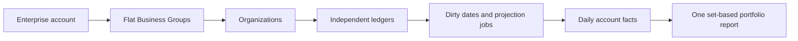

# Business Groups Multi-Selection and Architecture Review

Date: 2026-08-01

Status: findings revalidated against the implementation and updated after the flat-portfolio and projection work. Changes are local until migrated and deployed.

## Final product decision

Business Groups is a flat Enterprise portfolio view, not a nested workspace tree.

- Users may select several groups in one report.
- One organization may have only one enabled group assignment inside an Enterprise account.
- Every organization keeps its own ledger and RLS boundary.
- Combined results deduplicate organization IDs defensively.
- Corporate ownership or consolidation structure, if required later, must use explicit effective-dated dimensions rather than parent placement.

## Revalidated findings

| Original finding                                                                   | Current result                                                        | Evidence in the implementation                                                                                                      |
| ---------------------------------------------------------------------------------- | --------------------------------------------------------------------- | ----------------------------------------------------------------------------------------------------------------------------------- |
| The page could select only one group.                                              | Resolved.                                                             | Searchable multi-checkbox combobox, URL-backed selection, group comparison, and combined metrics.                                   |
| A business shared by two groups could be double-counted.                           | Resolved at service, database, and report layers.                     | Serialized link validation, a partial uniqueness constraint, disabled link choices, and defensive report deduplication.             |
| Parent placement was difficult to explain and introduced partial-access ambiguity. | Removed by design.                                                    | Migration `0031` drops the parent column and hierarchy constraints; the service and UI now expose only flat linked businesses.      |
| Recursive hierarchy reads risked query fan-out.                                    | Removed.                                                              | There is no organization parent traversal. Group/entity access is loaded in bounded set queries.                                    |
| Live reporting still performed one report query per organization.                  | Resolved for the projection source; retained only as a rollback path. | Organization/date/account facts and one set-based portfolio query replace financial N+1 in projection mode.                         |
| Projection lag could make incomplete data look like zero.                          | Resolved.                                                             | Requested/applied versions and initial-backfill state gate reads; all totals are withheld when any selected business is incomplete. |
| Projection mutations could lose concurrent updates.                                | Resolved.                                                             | Exact dirty dates, one organization job, row locking, and version-fenced deletion.                                                  |
| There was no safe cutover proof.                                                   | Resolved in code; production observation remains a release gate.      | `live`, `shadow`, and `projection` modes plus durable per-metric mismatch evidence.                                                 |
| Projection canarying required a whole deployment switch.                           | Resolved in code; production use remains gated.                       | `shadow` plus an authorized Enterprise-account UUID allowlist promotes only named accounts to projection reads.                     |
| Large business lists returned one unbounded ranking payload.                       | Resolved.                                                             | The ranking is paginated at 25 rows while aggregates and reconciliation use the complete authorized set.                            |
| Manual rebuild/recovery lacked an operator path.                                   | Resolved.                                                             | Read-only status/dry-run and explicit scoped `--apply` replay command requiring `DATABASE_URL_ADMIN`.                               |

## Simplified data flow

The group relationship answers “which portfolio contains this business?” It does not model a legal-entity tree.

## Controls retained

- Enterprise entitlement and linked-business allowance.
- Dry-run-first contract provisioning outside the customer request path; applied changes are versioned and audited.
- Enterprise, group, and direct-organization membership gates.
- Non-leaking partial-access counts.
- Active/grace/locked lifecycle behavior.
- Mixed currencies are never summed.
- One enabled assignment per Enterprise account and organization.
- Non-destructive unlinking.
- Durable queue with a scheduler backstop; notifications are only latency hints.
- Full replay, exact-date rebuild, retry state, and readiness telemetry.
- Shadow mismatches remain tenant-scoped under RLS.

## Remaining release work, not missing product code

1. Have the owner of the separate canonical deployment repository verify the current target and billing state; this dated application-repository audit is not production authority.
2. Through that canonical path, provision Cloud SQL, Artifact Registry, runtime/deployer identities, Workload Identity Federation, Secret Manager, and fresh R2/OAuth/email integrations.
3. Apply migrations `0028` through `0036` and verify all nine checksums on that exact target.
4. Bind and verify the four `STRIPE_ENTERPRISE_*` values, the signed webhook endpoint, the no-quantity-change portal configuration, and the separate runtime/admin database URLs.
5. Validate the `buwiz-books-job-worker` scheduler and secret in that environment.
6. Run a scoped backfill and wait for every target to become ready.
7. Run a representative all-shadow window and investigate every mismatch.
8. Add only the pilot Enterprise account to the projection allowlist; retain global `live` as the fleet rollback switch.
9. Enforce the documented lag, job-age, failure, and zero-unexplained-mismatch gates.
10. Capture customer-specific access and mixed-currency acceptance evidence.

These are deployment and rollout gates. They must not be reported as completed from local repository work alone.
