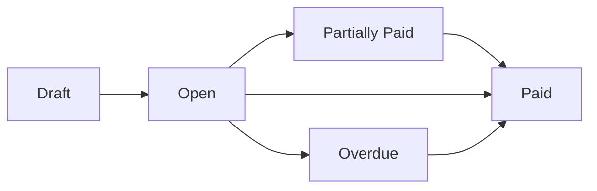

## What are Bills?

**Bills** represent money your business owes to vendors and suppliers. The Bills module helps you track, approve, and pay your accounts payable.

## Bill Lifecycle

| Status             | Meaning                                  |
| ------------------ | ---------------------------------------- |
| **Draft**          | Bill is being entered, not yet finalized |
| **Open**           | Bill is approved and awaiting payment    |
| **Partially Paid** | Some payments applied, balance remaining |
| **Paid**           | Fully paid — balance is zero             |
| **Overdue**        | Past the due date with unpaid balance    |

## Key Features

<CardGroup cols={2}>
  <Card title="AI Bill Scanning" icon="magic-wand-sparkles" href="/bills/ai-bill-scanning">
    Upload PDF/image bills and let AI extract the details automatically
  </Card>
  <Card title="Payment Tracking" icon="money-check-dollar" href="/bills/managing-bills">
    Record full or partial payments against bills
  </Card>
  <Card title="Vendor Linking" icon="building" href="/entities/vendors">
    Bills are linked to vendors for spend tracking and reporting
  </Card>
  <Card title="Document Attachment" icon="paperclip">
    Attach the original invoice PDF for audit compliance
  </Card>
</CardGroup>

## Bill List View

The Bills page shows all bills with:

- **Bill Number** — Unique identifier
- **Vendor** — Who the bill is from
- **Date** — Bill date
- **Due Date** — Payment deadline
- **Amount** — Total bill amount
- **Balance** — Remaining unpaid amount
- **Status** — Current lifecycle state
