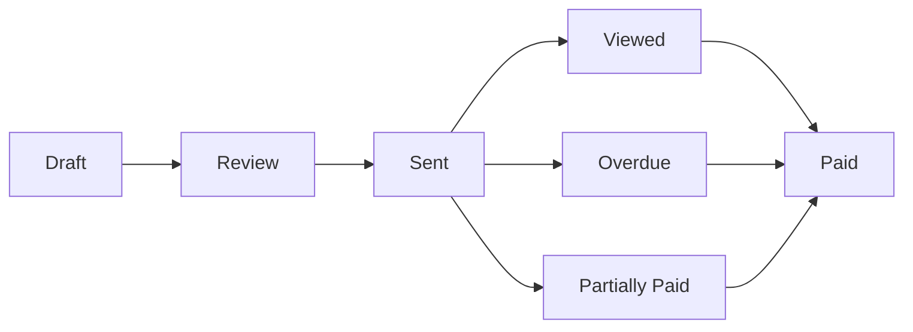

## What are Invoices?

**Invoices** are documents you send to customers requesting payment for goods or services. The Invoices module manages the full lifecycle from draft creation to payment collection.

## Invoice Lifecycle

| Status             | Meaning                                                      |
| ------------------ | ------------------------------------------------------------ |
| **Draft**          | Being edited, not yet finalized                              |
| **Review**         | Ready for internal review before sending                     |
| **Sent**           | Delivered to the customer                                    |
| **Viewed**         | Customer has opened the invoice (tracked via payment portal) |
| **Partially Paid** | Some payment received, balance remaining                     |
| **Paid**           | Fully paid                                                   |
| **Overdue**        | Past due date with outstanding balance                       |

## Key Features

<CardGroup cols={2}>
  <Card title="Professional Templates" icon="file-lines">
    Clean, branded invoice PDFs with your logo and business details
  </Card>
  <Card title="Customer Payment Portal" icon="credit-card" href="/invoices/payment-portal">
    Customers can view and pay invoices online
  </Card>
  <Card title="Automatic Journal Entries" icon="book">
    Posting an invoice auto-creates AR journal entries
  </Card>
  <Card title="Payment Tracking" icon="money-check-dollar">
    Record and track full or partial payments
  </Card>
</CardGroup>

## Invoice List View

The Invoices page shows all invoices with sortable columns:

- **Invoice Number** — Sequential identifier
- **Customer** — Who the invoice is for
- **Date** — Issue date
- **Due Date** — Payment deadline
- **Amount** — Total invoice value
- **Status** — Current lifecycle state
