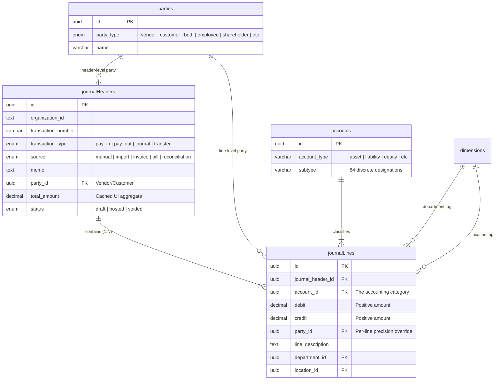
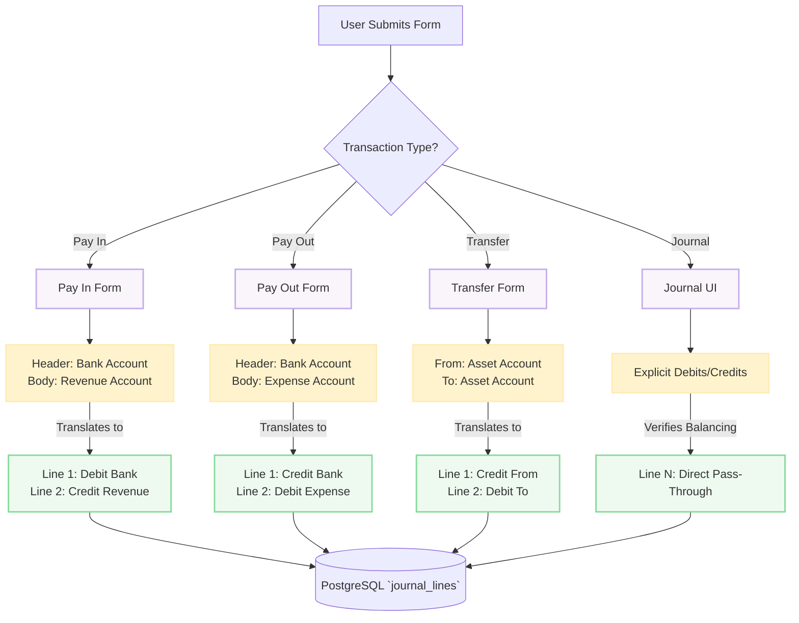

# Journal & Ledger Architecture

The Veritas Ledger operates on a strictly disciplined double-entry accounting foundation. Every financial event within the platform—regardless of how it is presented in the UI—is ultimately decomposed into a unified `journalHeader` enclosing multiple `journalLines`.

## Relational Entity-Relationship Diagram

## "Syntactic Sugar" vs Core Double-Entry

To provide a modern, highly intuitive experience, the frontend exposes four distinct visual paradigms (`pay_in`, `pay_out`, `transfer`, `journal`). However, the database does not distinguish between them structurally.

The `transaction_type` enum dictates how the server interpolates the UI form into exact debit and credit lines.

### Transaction Transformation Pipeline

### 1. Pay In (`pay_in`)

- **UI Mental Model**: "I received money inside this Bank Account from XYZ customer."
- **Data Execution**: The targeted Bank Account is assigned to `Line 0` and forcefully recorded as a **Debit** (because assets increase with Debits). All granular "Pay For" lines in the form are converted into sequential **Credit** lines assigned to the chosen accounts (e.g., Sales Revenue).

### 2. Pay Out (`pay_out`)

- **UI Mental Model**: "I spent money from this Bank Account to XYZ vendor."
- **Data Execution**: The inverse of Pay In. The Bank Account is forcefully recorded as a **Credit** (asset decreases). All granular "Pay For" lines are recorded as **Debit** lines (expenses increase via debits).

### 3. Transfer (`transfer`)

- **UI Mental Model**: "I moved money identically from Account A to Account B."
- **Data Execution**: Restricted heavily. It strictly generates 2 lines. `Account A` is Credited. `Account B` is Debited. Both accounts _must_ be classified under the `asset` or `liability` roots.

### 4. Journal (`journal`)

- **UI Mental Model**: "I am adjusting the books directly."
- **Data Execution**: No syntactic sugar is applied. The system relies entirely on the server-side validator to ensure `SUM(debits) = SUM(credits)` across the payload dimension array before appending rows to PostgreSQL.
