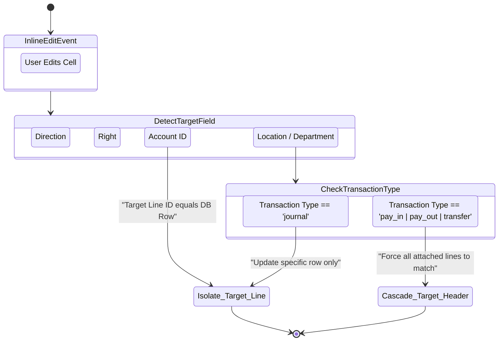

# Ledger Inline Editing & State Propagation

When viewing the massive `Ledger Datagrid`, the user is seeing hundreds of ungrouped `journalLines` sorted chronologically. This section defines the structural propagation physics—when a user executes an inline edit on a single Ledger cell (e.g., swapping a Department tag), how does that solitary edit ripple across the rest of the underlying `journalHeader` payload?

## Field Propagation Matrix

The `updateTransactionsBatch` function enforces these specific propagation constraints explicitly.

| Property Edited                 | `pay_in` Reaction          | `pay_out` Reaction         | `transfer` Reaction        | `journal` Reaction      |
| ------------------------------- | -------------------------- | -------------------------- | -------------------------- | ----------------------- |
| **Category** (`accountId`)      | Hits specific line only    | Hits specific line only    | Hits specific line only    | Hits specific line only |
| **Department** (`departmentId`) | ⚠️ Shared across all lines | ⚠️ Shared across all lines | ⚠️ Shared across all lines | 🎯 Specific line only   |
| **Location** (`locationId`)     | ⚠️ Shared across all lines | ⚠️ Shared across all lines | ⚠️ Shared across all lines | 🎯 Specific line only   |
| **Party** (`partyId`)           | ⚠️ Header-level cascade    | ⚠️ Header-level cascade    | 🎯 Specific line only      | 🎯 Specific line only   |
| **Amount** (`debit/credit`)     | 🚫 BLOCKED                 | 🚫 BLOCKED                 | 🚫 BLOCKED                 | 🚫 BLOCKED              |

> [!CAUTION]
> Ledger amounts (debit/credit arrays) are mechanically sealed. Inline ledger grids **never** permit raw balancing adjustments. The user must click the exact transaction to launch the proper multi-line adjustment UI to fix numerical imbalances safely.

## Propagation Physics

Below demonstrates how cell edits behave differently depending on the source `transaction_type`.

### Explaining the Sugar Cascade

Because `pay_in` and `pay_out` UI configurations utilize the overarching concept of a "Header", when the user tags a Department (e.g., "Engineering") onto a random $5 debit line from the ledger view, the system accurately guesses that the entire transaction was intended for Engineering. The `updateTransactionsBatch` executes an overarching `UPDATE` replacing every sibling row associated under that `journal_header_id` with the same tag simultaneously.

For raw `journal` entries, we assume high-fidelity granular intent. Replacing Line 2's department has mechanically zero impact on Line 1.
