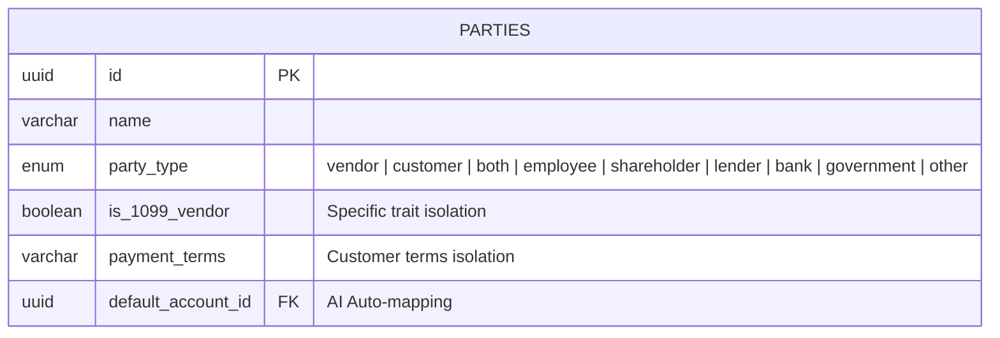
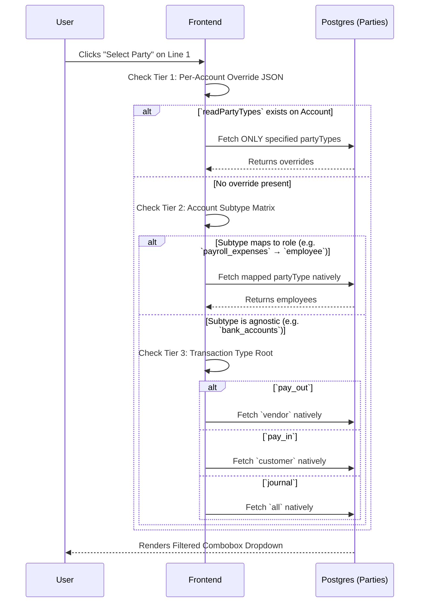

# Polymorphic Party Resolution Architecture

The concept of a "Party" encompasses anyone or any institution the business interacts with financially. Instead of maintaining totally separated databases for vendors, customers, and banks, Veritas Ledger fuses them into a single, highly flexible `parties` schema distinguished by a dynamic `partyType` discriminator.

## Database Schema Configuration

The core discriminator sits exactly as defined in `src/db/schema/parties.ts`. The schema currently recognizes 9 precise hierarchical entity types natively.

By keeping fields like `is_1099_vendor` nullable and soft-grouped, any `partyType` can adopt traits organically without catastrophic foreign key restrictions.

## UI Resolution Priority (The Cascade)

When a developer or system user creates a transaction, the frontend intelligently filters the "Select Party" dropdown so an employee doesn't accidentally log software purchases against the state tax board.

The filter is resolved using a strict **Priority Cascade Hierarchy**.

## Matrix of Expected Subtype Resolutions (Tier 2 rules)

When an account is selected on a line, the subtype dictates the smartest intelligent assumption.

| Subtype Cohort                                                                    | Forces Party Resolution Match (Tier 2) |
| --------------------------------------------------------------------------------- | -------------------------------------- |
| `cost_of_goods`, `hosting_fees`, `accounts_payable`, `fixed_assets`               | 🟩 `vendor`                            |
| `account_receivable`, `sales_revenue`, `subscription_revenue`, `bad_debt_expense` | 🟦 `customer`                          |
| `payroll_expenses`, `cost_of_labor`                                               | 🟨 `employee`                          |
| `long_term_debt`, `interest_expense`, `convertible_notes`, `investments`          | 🟧 `lender`                            |
| `common_stock`, `retained_earnings`, `shareholder_loans`                          | 🟪 `shareholder`                       |
| `taxes`, `payroll_liabilities`                                                    | 🟥 `government`                        |
| `bank_accounts`, `bank_fees`, `credit_cards`                                      | 🟫 `bank`                              |

_(If none of the fine-grained subtypes apply, resolution shifts identically to Tier 3)._
