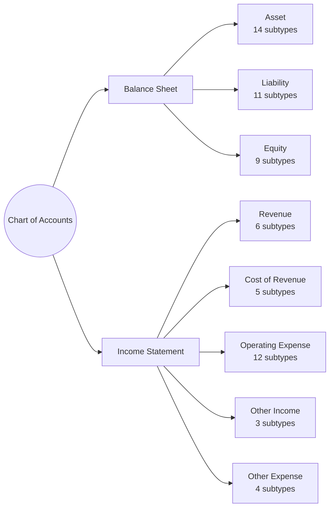
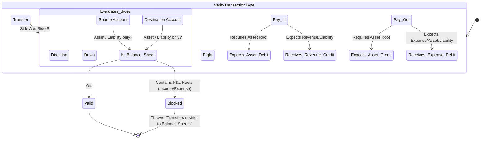

# Transaction ↔ Category Classification System

Veritas Ledger relies exclusively on an 8-root primary framework, expanding down into **64 discrete Account Subtypes**. This architecture serves as the entire heartbeat of AI-auto categorization.

We do not use PostgreSQL enums for subtypes. They exist entirely as `string[]` arrays in `src/db/schema/account-constants.ts` enforced strictly by runtime Zod validation. This ensures database migrations do not brick when adding new accounting subtypes mid-cycle.

## 8-Root Foundation Hierarchy

## The 64 Discrete Subtypes

Every account generated inherently inherits exactly one of these identifiers. The identifier drives how the UI restricts dropdown placements (e.g., blocking an Equity account from appearing in a routine Sales Invoice context).

### Assets (14)

`account_receivable` • `accrued_revenue` • `asset_clearing` • `bank_accounts` • `fixed_assets` • `goodwill` • `intangible_assets` • `inventory` • `investments` • `other_current_assets` • `other_long_term_assets` • `prepaid_expenses` • `shareholder_loans` • `uncategorized_assets`

### Liabilities (11)

`accounts_payable` • `accrued_expenses` • `convertible_notes` • `credit_cards` • `deferred_revenue` • `liability_clearing` • `long_term_debt` • `other_current_liabilities` • `other_long_term_liabilities` • `short_term_debt` • `payroll_liabilities`

### Equity (9)

`additional_paid_in_capital` • `common_stock` • `other_comprehensive_income` • `owners_equity` • `preferred_stock` • `retained_earnings` • `safes` • `treasury_stock` • `uncategorized_equity`

### Revenue (6)

`partner_revenue` • `refunds_discounts` • `sales_revenue` • `subscription_revenue` • `transaction_revenue` • `uncategorized_income`

### Cost of Revenue (5)

`cost_of_goods` • `cost_of_labor` • `hosting_fees` • `other_cost_of_revenue` • `payment_processing_fees`

### Operating Expenses (12)

`bad_debt_expense` • `bank_fees` • `business_application_software` • `facilities` • `general_operations` • `insurance` • `payroll_expenses` • `professional_fees` • `sales_marketing` • `supplies_and_materials` • `travel_entertainment` • `uncategorized_expenses`

### Other Income / Other Expenses (7 Combined)

`credit_card_rewards` • `interests_dividends` • `other_miscellaneous_income` • `depreciation_amortization` • `interest_expense` • `other_miscellaneous_expenses` • `taxes`

---

## Transaction Validation Guardrails

To prevent corrupt double-entry flows, the system utilizes strict categorical bounds based on the root of the selected Subtype.

### Contextual Filters

1. **Transfer Limitations:** You absolutely cannot transfer funds into `sales_revenue` or `payroll_expenses`. Transfers must strictly terminate inside `Asset` or `Liability` ledgers exclusively (Bank accounts to Credit Cards, Savings to Checking, etc).
2. **Depreciation Isolation:** Subtypes mapping to `depreciation_amortization` will be rejected by standard `pay_out` parsers due to lack of cash-flow impact. They strictly require a full `journal` transaction.
3. **Pay_In Protection:** Expense subtypes inherently vanish from Pay_In suggestion trees unless specifically overridden via JSON array injection configurations within the `accounts` record.
